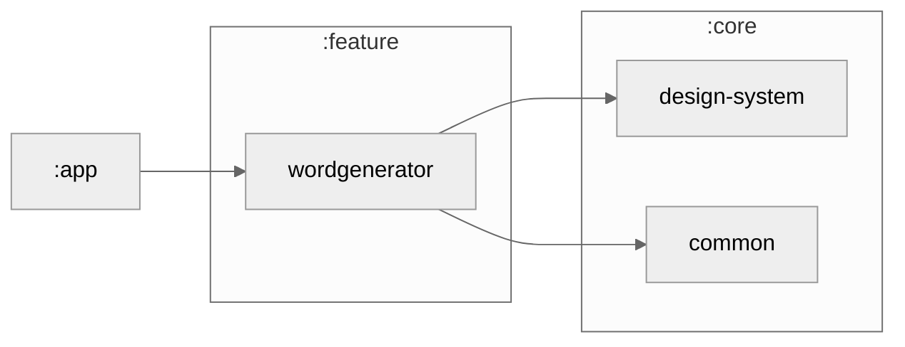

# Module graph

```mermaid
%%{
  init: {
    'theme': 'neutral'
  }
}%%

graph LR
  subgraph :core
    :core:design-system["design-system"]
    :core:common["common"]
  end
  subgraph :feature
    :feature:wordgenerator["wordgenerator"]
  end
  :app --> :feature:wordgenerator
  :feature:wordgenerator --> :core:design-system
  :feature:wordgenerator --> :core:common
```