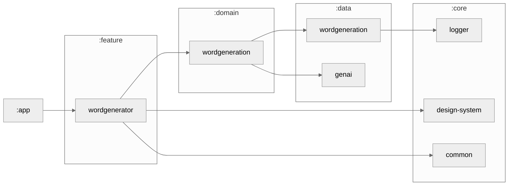

# Module graph

```mermaid
%%{
  init: {
    'theme': 'neutral'
  }
}%%

graph LR
  subgraph :core
    :core:logger["logger"]
    :core:design-system["design-system"]
    :core:common["common"]
  end
  subgraph :data
    :data:wordgeneration["wordgeneration"]
    :data:genai["genai"]
  end
  subgraph :domain
    :domain:wordgeneration["wordgeneration"]
  end
  subgraph :feature
    :feature:wordgenerator["wordgenerator"]
  end
  :domain:wordgeneration --> :data:wordgeneration
  :domain:wordgeneration --> :data:genai
  :data:wordgeneration --> :core:logger
  :app --> :feature:wordgenerator
  :feature:wordgenerator --> :core:design-system
  :feature:wordgenerator --> :domain:wordgeneration
  :feature:wordgenerator --> :core:common
```